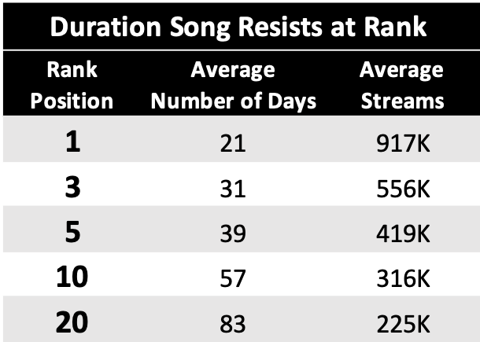

## **Spotify’s 2019 Worldwide Daily Song Rankings**           
#### The 200 daily most streamed songs in 10 countries

___

 ***<code>Acknowledgment:</code>*** This task is inspired by a project done by *http://eduar.do* shared on Kaggle with the context of exploring how artists and song’s popularity varies overtime [*here*](https://www.kaggle.com/edumucelli/spotifys-worldwide-daily-song-ranking). This work is an extension of the same by analyzing daily ranking of the 200 most listened songs by Spotify users in 10 countries that contribute most to Spotify’s bottom line [*here*](https://www.hypebot.com/hypebot/2018/02/which-countrys-contribute-most-to-spotifys-bottom-line-chart.html).

### Introduction
___

*Spotify* transformed music listening forever when it launched in Sweden in 2008 and became one of the most popular global audio streaming subscription service with 271m users, including 124m subscribers, across 79 markets. All throughout the last year, users have streamed countless hours of their favorite songs, artists, playlists, and podcasts. In this analysis, using Spotify’s chart of 2019 I will highlight the common trends and use regression models to forecast the number of tracks stream and its associated popularity.

#### Data

Dataset contains the daily ranking of the 200 most listened songs in **USA**, **UK**, **Mexico**, **Germany**, **Brazil**, **Canada**, **Australia**, **Netherlands**, **France** and **Sweden**. It contains 730,000 rows, which comprises 2574 artists, 8825 songs for a total count of eighty-eight billion streams count.
The data spans from 1st January 2019 to 31st December 2019 and includes 7 columns.
It has been collected from Spotify's regional chart [data.](https://spotifycharts.com/regional)

### Objective and MVP
___

I used the information given in the database to predict the rank position or the number of streams a song will have in the future and expanded the analysis to learn factors such as: 
- Duration songs “resist” on the top 3, 5, 10, 20 ranking.                                                                   
- What are the signs of a song that gets into the top rank to stay                                                        
- Do countries share same top-ranking artists or songs                                                                    
- Are people listening to the very same top-ranking songs on countries far away from each other? 

### Data Scrapping, Cleaning & Feature Engineering
___

**<code>Scrapping:</code>** Data is scrapped by downloading the CSV file using Spotify top 200 daily API and converted to a Pandas data frame.  **<code>Cleaning:</code>**  Missing data have been removed from the table as they were insignificant and region codes are all replaced with the country’s name. Miscategorized datatypes are also converted to the right format, for example the ‘date’ column has been converted from an object to datetime and set as index, and rank position changed from continuous to a discrete. Also, categorical variables are encoded as part of the data processing.  
**<code>Feature Engineering :</code>** To run the models faster I created separate data frame for each country and used USA table as a pilot and then tested the model for each country individually. Since the rank position for an artist could vary depending on song’s popularity, number of streams and the region, I have created new variables for average rank, top rank, low rank based on average, maximum and minimum streams. The new features drastically improved the model’s R2 score. 

### Data Analysis
___

For easier analysis and collaboration, I have built a dashboard to visualize and track Spotify music trends. For a more in-depth insights, download and interact with this *[sample dashboard]* on *Tableau Public.*  

### Modeling
___

**<code>Rank Position</code>**

Initially, I have computed Linear Regression and used Multi-output regression predict multiple output/target variables. I took artist and streams to forecast average/max/min rank variables simultaneously. As tuning /fitting process, after standardizing(scaling) data I used PCA to find linear combinations of current predictor variables and created new "principal components". This process helped to reduce dimensionality and understand the most important "directions" in the data.  However, after plotting the Linear Regression of actual vs prediction residual I realized that the outcome did not change in proportion to a change in any of the inputs, in other words, the plot indicated nonlinearity: 

 

And therefore, I computed the Random Forest Regressor that uses  averaging of classifying decision trees on sub-samples of the dataset to improve the predictive accuracy and control over-fitting. The result looks promising:
  
Summary of Regression Results:

The train R2 Score on the Rank Position data is:  98.6%  
The train RMSE on the Rank Position data is:  6 
 
The test R2 Score on the Rank Position data a is: 91.9%  
The train RMSE on the Rank Position data is:  15 

 

**<code>Rank Resistance</code>**

Results indicated that choosing only one attribute (# of Streams ) is not suffcient to predict the duration of a song remaining on it's current rank, however EDA can still be used for some directional insights:

 

### Conclusion and Next Steps
___

In general, the popularity rating is based on total number of streams compared to other tracks as well as how recent those streams are, however that alone does not factor in determining the songs success. As shown in the data, countries share the same top-ranking songs, and that shows how factors like social trend, location, artist and genre are significant to track’s popularity. Nonetheless, exploring songs features could provide further insights for artists and music agents who are looking for Spotify users view and their perceived values.

Next steps identified to expand on this project are as follows: 
-Real Time KPI Dashboard:  connecting to Spotify data and get the latest data from Spotify’s charts and bring it into Tableau for analysis. 
- Extend the data set to include all countries where Spotify is available and add podcast as a separate category. 
- Further analysis to learn engagement by streaming device e.g. phone, computer or tablet. 
- Explore impact of attributes such as song genre, keys, energy, danceability, instrumentals, etc. on its popularity and create a regression model to predict song’s popularity based on these features.

### Sources & Requirements
___

• [Spotify | Charts](https://spotifycharts.com/regional) 
• Scikitlearn==0.21 
• Spotipy== fycharts.SpotifyCharts Tweet 
• Pandas==1.0.
